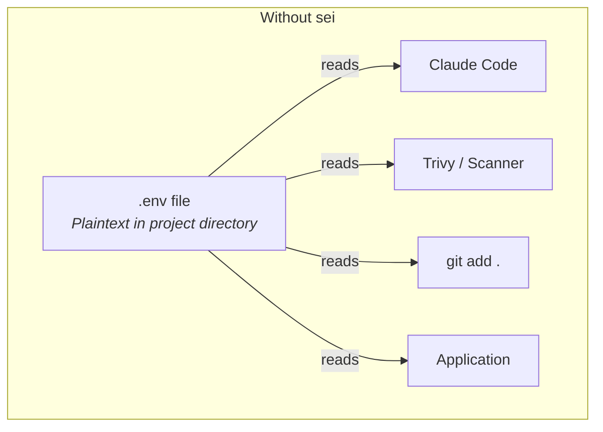
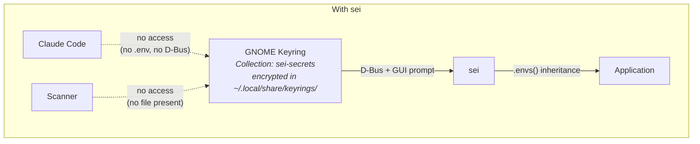
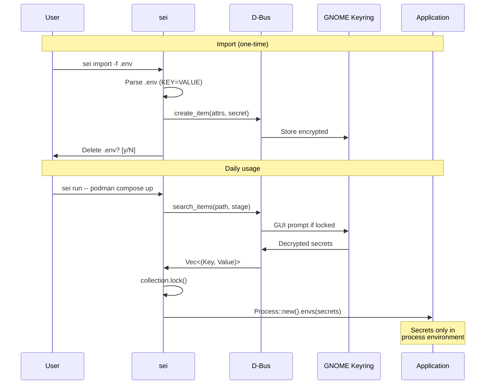
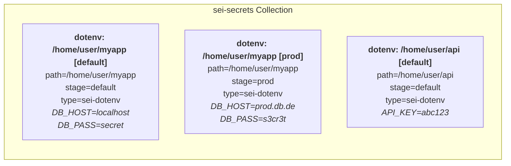
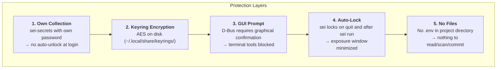

# sei — Save Env Inject

Manages environment secrets in GNOME Keyring instead of `.env` files. TUI editor for editing, CLI for injection.

## Why?

`.env` files sit in the project directory — any tool with file access can read them:

- **AI agents** (Claude Code, Copilot) read project files for context analysis
- **Security scanners** with vulnerabilities (e.g. Trivy security breach — secrets were exfiltrated)
- **CI/CD pipelines** and build tools scan the working directory
- **`git add .`** accidentally commits secrets

`sei` stores secrets in GNOME Keyring — encrypted, protected by GUI prompt, invisible to file-based tools.

## Architecture





## Data Flow



## Keyring Structure



Each entry is an item in the keyring collection `sei-secrets` with attributes `path`, `stage`, `type=sei-dotenv` and the secret as `KEY=VALUE\n` pairs. The collection is created automatically on first start.

## Installation

```bash
# One-liner (when published)
curl -fsSL https://xi72yow.github.io/sei/install.sh | sudo bash

# Build + install (requires Podman)
./build.sh --install

# Or build only
./build.sh
sudo apt install --reinstall ./dist/sei_0.1.0-1_amd64.deb
```

Prerequisite: Running GNOME Keyring daemon (`gnome-keyring-daemon`). Also works with KeePassXC or any other daemon implementing the [freedesktop Secret Service API](https://specifications.freedesktop.org/secret-service/latest/).

## Usage

### TUI Dashboard

```bash
sei
```

```
┌─ Projects ─────────────────────┬─ Details ──────────────────────────┐
│                                │                                    │
│ ▸ myapp [prod]                 │  Path:  /home/user/projects/myapp  │
│   myapp [default]              │  Stage: prod                       │
│   api [default]                │  Keys:  4                          │
│                                │                                    │
│                                │  Key        Value                  │
│                                │  DB_HOST    ••••••••               │
│                                │  DB_PASS    ••••••••               │
│                                │  API_KEY    ••••••••               │
│                                │  PORT       ••••••••               │
│                                │                                    │
└────────────────────────────────┴────────────────────────────────────┘
[E]dit  [D]elete  [C]opy  [S]how/hide  [N]ew  [I]mport .env  [Q]uit
```

- Project list shows only the folder name, full path in the details pane
- Long paths scroll automatically (marquee animation)
- Values masked by default

| Key | Action |
|-----|--------|
| `e` / `Enter` | Open textarea editor (paste with Ctrl+Shift+V) |
| `d` | Delete entry (safety confirmation) |
| `s` | Reveal / mask values |
| `n` | Create new entry |
| `i` | Import `.env` file |
| `c` | Copy entry (different path/stage) |
| `q` / `Esc` | Quit (locks keyring) |
| `Ctrl+C` | Force quit (locks keyring) |

### Editor

The editor is a fullscreen textarea in `KEY=VALUE` format — one variable per line. `.env` contents can be pasted directly via **Ctrl+Shift+V**.

```
┌─ Editor: myapp [prod] ────────────────────────────────────────────┐
│  Format: KEY=VALUE (one line per variable, paste with Ctrl+Shift+V)
├───────────────────────────────────────────────────────────────────┤
│ DB_HOST=prod.db.de                                                │
│ DB_PASS=s3cr3t                                                    │
│ API_KEY=abc-xyz-123                                               │
│ PORT=3000                                                         │
└───────────────────────────────────────────────────────────────────┘
Paste: Ctrl+Shift+V  |  Esc: save  |  Ctrl+Q: discard
```

### Import

```bash
# Import .env from current directory
sei import

# Specific file + stage
sei import -f staging.env -s prod
```

After import, `sei` asks whether to delete the `.env` file. A warning is shown for world-readable files.

### Running Commands

```bash
# Native
sei run node server.js

# With stage
sei run -s prod node server.js

# Envs from a different project
sei run -p ~/projects/myapp -s prod node server.js

# Podman / Docker
sei run podman compose up -d

# Single containers too
sei run podman run --rm myimage

# -- only needed when the command starts with a flag
sei run -s test -- --some-flag
```

Secrets are passed to the child process via environment inheritance — no temp files, no CLI arguments. The keyring is locked after loading.

> **Note for Compose:** The `compose.yml` must reference the variables, e.g. with `environment: - DB_HOST` (value from host environment) or `${DB_HOST}` for interpolation.

## Security Model



| Attack Vector | Without sei | With sei |
|---------------|-------------|----------|
| AI agent reads project files | `.env` directly readable | No file present |
| AI agent uses `secret-tool` | - | GUI prompt blocks terminal |
| Scanner exfiltrates secrets | `.env` is found | Nothing on disk |
| `git add .` / `git commit -a` | `.env` gets committed | Nothing to commit |
| Shoulder surfing / screen capture | `.env` open in editor | Values masked |
| Process monitoring (`ps`) | - | Secrets not in CLI arguments |
| Root access / disk forensics | `.env` plaintext | Keyring encrypted |

## Technical Details

- **Language:** Rust (no `unsafe`)
- **TUI:** ratatui + ratatui-textarea + crossterm
- **Keyring:** `secret-service` crate (D-Bus, pure Rust)
- **Collection:** `sei-secrets` (own collection, own password)
- **Item type:** `type=sei-dotenv` (attribute filter)
- **Async:** tokio (secret-service is async-first)
- **CLI:** clap (derive)
- **Build:** Container-based via Podman (`build.sh`)
- **Package:** `.deb` for amd64 (stripped, LTO, auditable SBOM)

## Testing

```bash
# 1. Create test file
cat > .env.test << 'EOF'
DB_HOST=localhost
DB_PORT=5432
DB_USER=testuser
DB_PASS=s3cr3t_p4ss!
API_KEY=sk-test-abc123xyz
NODE_ENV=development
PORT=3000
EOF

# 2. Test import
sei import -f .env.test -s test
# → Asks whether to delete .env.test (N for testing)

# 3. Test TUI
sei
# → Entry visible in project list
# → [S] Reveal values — 7 keys?
# → [E] Open editor — KEY=VALUE format, test paste
# → Esc → Validation + save dialog
# → Ctrl+Q → Discard without saving
# → [N] New entry → Enter creates directly + opens editor
# → [C] Copy entry
# → [D] Delete entry (type path to confirm)
# → [Q] Quit — keyring locked?
# → Ctrl+C — keyring locked?

# 4. Test sei run
sei run -s test env | grep DB_HOST
# → DB_HOST=localhost

# 5. Reference another project
sei run -p /path/to/project -s prod env | grep API_KEY

# 6. Clean up
sei   # → Delete test entry in TUI
rm -f .env.test
```

## License

Not yet licensed. All rights reserved.
