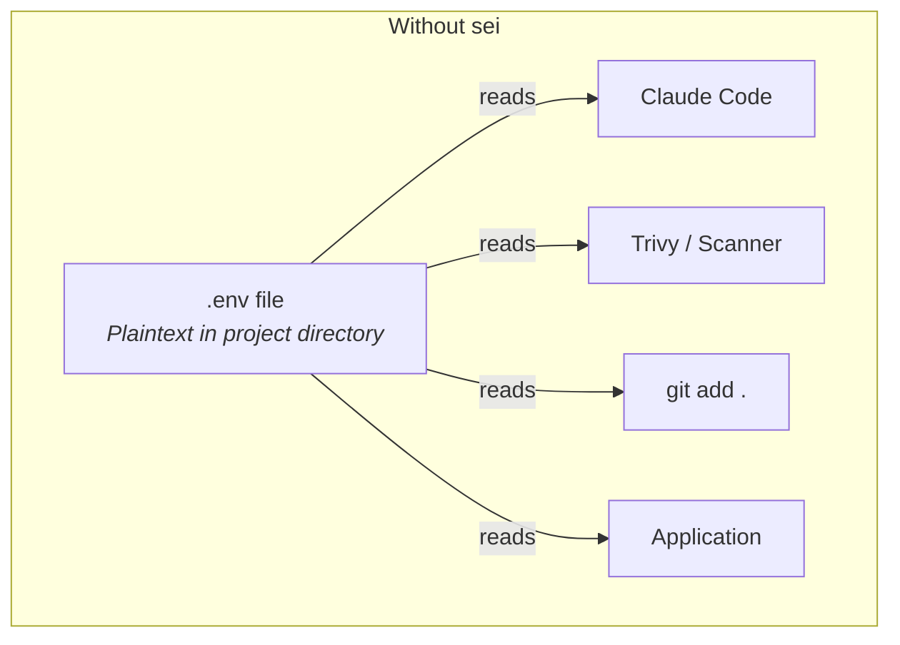
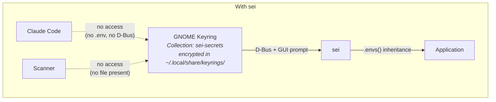
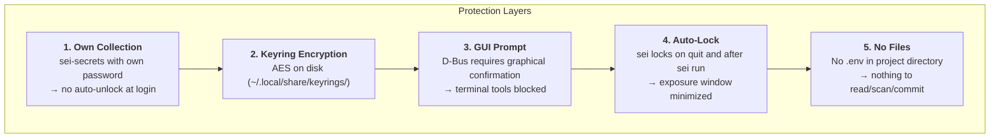

# sei — Save Env Inject

Manages environment secrets in GNOME Keyring instead of `.env` files. TUI for editing, CLI for injection.

## Why?

`.env` files sit in the project directory — any tool with file access can read them:

- **AI agents** (Claude Code, Copilot) read project files for context analysis
- **Security scanners** with vulnerabilities (e.g. Trivy — secrets were exfiltrated)
- **CI/CD pipelines** and build tools scan the working directory
- **`git add .`** accidentally commits secrets

`sei` stores secrets in GNOME Keyring — encrypted, protected by GUI prompt, invisible to file-based tools.

## Architecture





## Installation

```bash
# Build + install (requires Podman)
./build.sh --install

# Or build only
./build.sh
sudo apt install --reinstall ./dist/sei_0.1.0-1_amd64.deb
```

Prerequisite: Running GNOME Keyring daemon (`gnome-keyring-daemon`). Also works with KeePassXC or any other daemon implementing the [freedesktop Secret Service API](https://specifications.freedesktop.org/secret-service/latest/).

## Usage

### TUI

```bash
sei
```

```
 Import (2) │ Store                     /home/user/myapp
┌─ .env Dateien (2) ────────┬─ Diff ───────────────────────────┐
│                            │                                   │
│ ▸ [x] .env (neu)          │  .env → [default]                 │
│   [x] .env.prod (update)  │                                   │
│                            │  + DB_HOST=localhost               │
│                            │  + DB_PORT=5432                   │
│                            │  + DB_PASS=s3cr3t                 │
│                            │                                   │
├────────────────────────────┴───────────────────────────────────┤
│                                                                │
│ ↑↓ nav │ Space an/aus │ Enter importieren │ Tab Store │ Esc   │
└────────────────────────────────────────────────────────────────┘
```

On startup, `sei` scans for `.env*` files in the current directory. If new or changed files are found, the **Import** tab opens automatically with a diff view. Stage names are derived from the file suffix (`.env` → default, `.env.production` → production).

After import, the **Store** tab shows all keyring entries:

```
 Import │ Store                          /home/user/myapp
┌─ Projects ─────────────────┬─ Details ────────────────────────┐
│                             │                                  │
│ ▸ 001 myapp [default]      │  ID:    001                      │
│   002 myapp [production]   │  Path:  /home/user/myapp         │
│   003 api [default]        │  Stage: default                  │
│                             │  Keys:  4                        │
│                             │  Erstellt:  vor 2 Std            │
│                             │  Geaendert: gerade eben          │
│                             │                                  │
│                             │  Key        Value                │
│                             │  DB_HOST    ••••••••             │
│                             │  DB_PASS    ••••••••             │
│                             │                                  │
├─────────────────────────────┴──────────────────────────────────┤
│ ✓ 2 importiert [001, 002]                                      │
│ [E]dit [D]elete [C]opy [S]how [N]ew [I]mport │ Tab │ Esc quit │
└────────────────────────────────────────────────────────────────┘
```

Each entry gets a **3-digit ID** (001–999) for quick CLI access. Entries matching the current directory are highlighted. All keybindings are shown in the footer.

### Running Commands

```bash
# By ID (recommended)
sei 001 node server.js
sei 002 podman compose up -d

# By path + stage
sei run -s production -- node server.js
sei run -p ~/projects/api -s prod -- node server.js

# -- only needed when cmd starts with a flag
sei run --id 001 -- --some-flag
```

Secrets are passed via environment inheritance — no temp files, no CLI arguments. The keyring is locked after loading.

### Compose Integration

`sei` injects env vars into the process it spawns. For Compose, reference the variables in your `compose.yml`:

```yaml
services:
  app:
    image: myapp
    environment:
      - DB_HOST        # value from host env (set by sei)
      - DB_PORT
      - API_KEY
```

```bash
sei 001 podman compose up -d
```

## Security Model



| Attack Vector | Without sei | With sei |
|---------------|-------------|----------|
| AI agent reads project files | `.env` directly readable | No file present |
| AI agent uses `secret-tool` | — | GUI prompt blocks terminal |
| Scanner exfiltrates secrets | `.env` is found | Nothing on disk |
| `git add .` / `git commit -a` | `.env` gets committed | Nothing to commit |
| Shoulder surfing | `.env` open in editor | Values masked |
| Process monitoring (`ps`) | — | Secrets not in CLI arguments |
| Root access / disk forensics | `.env` plaintext | Keyring encrypted |

## Technical Details

- **Language:** Rust (no `unsafe`)
- **TUI:** ratatui + ratatui-textarea + crossterm
- **Keyring:** zbus (D-Bus, freedesktop Secret Service API, pure Rust)
- **Collection:** `sei-secrets` (own collection, own password)
- **Metadata:** 3-digit ID, created/updated timestamps per entry
- **Async:** tokio + futures-util
- **CLI:** clap (derive) + ID shorthand
- **Build:** Container-based via Podman
- **Package:** `.deb` for amd64 (stripped, LTO)

## License

Not yet licensed. All rights reserved.
